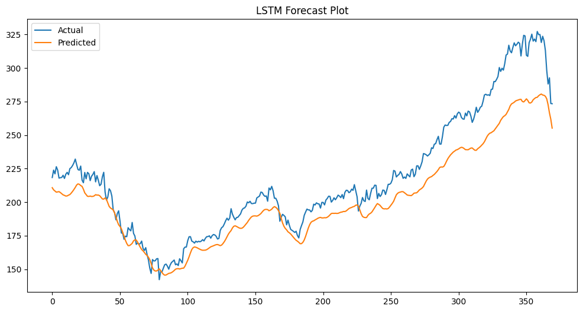
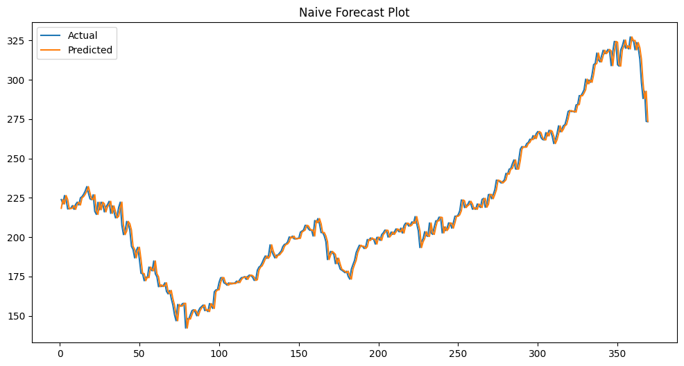

# Stock Price Prediction Using LSTM

## Project Overview

This project focuses on predicting stock closing prices using Long Short-Term Memory (LSTM), a type of Recurrent Neural Network (RNN) designed for time-series forecasting. The project includes data preprocessing, exploratory data analysis (EDA), stationarity testing, feature scaling, model training, and performance evaluation.

---

## Objective

To forecast future stock closing prices using historical stock market data and compare the performance of the LSTM model with a Naive Forecast baseline.

---

## Technologies Used

- Python
- Pandas
- NumPy
- Matplotlib
- Scikit-Learn
- TensorFlow / Keras
- Statsmodels

---

## Project Workflow

### 1. Data Collection
- Historical stock price dataset containing Date and Close Price.
### 2. Data Preprocessing
- Converted Date column to datetime format.
- Sorted data chronologically.
- Checked for missing and duplicate values.
- Removed duplicates if present.

### 3. Exploratory Data Analysis (EDA)
- Visualized stock price trends.
- Calculated Rolling Mean (30-day).
- Calculated Rolling Standard Deviation (30-day).

### 4. Stationarity Testing
- Applied Augmented Dickey-Fuller (ADF) Test.
- Confirmed stationarity before modeling.
### 5. Feature Scaling
- Used MinMaxScaler to normalize stock prices between 0 and 1.
- Fitted scaler only on training data to avoid data leakage.

### 6. Sliding Window Creation
- Created 60-day lookback windows.
- Used previous 60 days to predict the next day's closing price.

### 7. Model Development
Built a Sequential LSTM model with:
- LSTM Layer (50 units)
- Dropout Layer (20%)
- LSTM Layer (50 units)
- Dropout Layer (20%)
- Dense Output Layer

### 8. Model Training
- Optimizer: Adam
- Loss Function: Mean Squared Error (MSE)
- Epochs: 50
- Batch Size: 32

### 9. Model Evaluation
Evaluated using:
- MAE (Mean Absolute Error)
- RMSE (Root Mean Squared Error)
- MAPE (Mean Absolute Percentage Error)

### 10. Baseline Comparison
Compared LSTM performance with Naive Forecast.
## Model Performance

| Model | MAE | RMSE | MAPE |
|---------|---------:|---------:|---------:|
| LSTM | 12.12 | 16.26 | 4.97% |
| Naive Forecast | 2.92 | 4.05 | 1.37% |

### 11. Next-Day Stock Price Prediction
Comparison of next-day closing price predictions generated by the LSTM model and the Naive Forecast model.

| Model | Predicted Price |
|--------|---------------:|
| LSTM Prediction | 253.76 |
| Naive Prediction | 273.36 |

### Observation
- LSTM Predicted Price: **253.76**
- Naive Forecast Price: **273.36** (last observed closing price)
- Difference: **19.60**

---
## Project Visualizations

### LSTM Actual vs Predicted Prices



### Naive Actual vs Predicted Prices


## Key Findings

- Successfully implemented an end-to-end time-series forecasting pipeline.
- LSTM learned historical stock price patterns and generated future predictions.
- Naive Forecast outperformed LSTM on this dataset, highlighting the importance of baseline model comparison.
- Demonstrated practical understanding of feature scaling, stationarity testing, sequence generation, and deep learning for time-series analysis.
## Future Improvements

- Hyperparameter tuning
- Bidirectional LSTM
- GRU Models
- Multi-feature forecasting (Open, High, Low, Volume)
- Attention Mechanism
- Transformer-based Time Series Models

---

## How to Run

### Clone Repository
```bash
https://github.com/ajith2617/Stock-Price-Prediction-LSTM
```

### Install Dependencies

```bash
pip install -r requirements.txt
```

### Run Notebook

```bash
jupyter notebook
```

### Open:
```bash
Stock_Price_Prediction.ipynb
```
---
### Skills Demonstrated

- Data Cleaning
- Exploratory Data Analysis
- Time Series Analysis
- Feature Engineering
- Stationarity Testing
- Machine Learning
- Deep Learning
- LSTM Networks
- Model Evaluation
- Python Programming

---

## Author

Ajithkumar

Data Science Enthusiast | Healthcare Operations Professional | Python & SQL Learner
